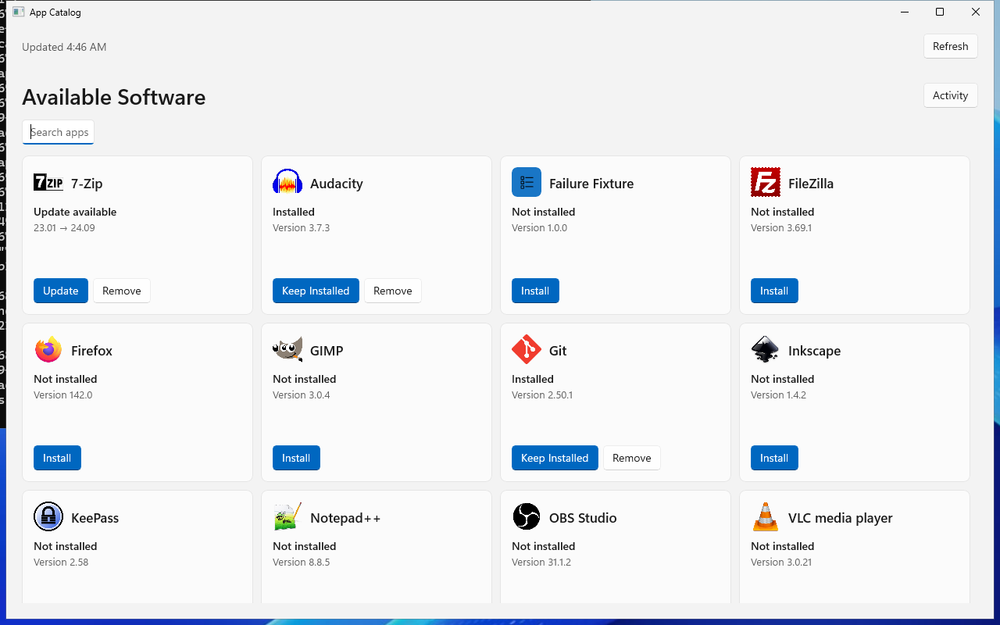

# App Catalog



App Catalog is Gorilla's Windows app for optional software. It gives users a simple way to find software Gorilla has made available, install it, remove it, and check what happened.

> **Pre-release:** App Catalog is still under development. Its behavior and interface may change before release.

## What you can do

App Catalog shows software assigned as `optional_installs` in Gorilla.

Depending on the app's current state, you may see actions such as:

- **Install** — install the app and have Gorilla keep it installed.
- **Update** — install an available update.
- **Enable Updates** — start managing an app that is already installed so Gorilla keeps it installed and updated.
- **Remove** — stop managing the app and uninstall it once.

Not every action is always available. Gorilla checks the computer's current state and Gorilla's catalog before allowing a change. If an action is unavailable, App Catalog explains why.

Removing an app does not create a permanent rule to keep it uninstalled. If it is installed again later outside Gorilla, App Catalog will not automatically remove it again unless another policy requires that.

## Execution scope

An accepted App Catalog Install or Remove action executes only the requested item and work causally required to complete that action. Install includes the requested item's required install dependencies. Remove uninstalls only the requested item and does not automatically remove dependencies.

App Catalog actions do not trigger unrelated managed installs, uninstalls, or updates. Normal `gorilla.exe` execution, service startup convergence, scheduled/periodic convergence, and explicit service Run operations continue to converge the full effective Gorilla-managed state.

## App icons

Repositories can provide an optional icon for each catalog item. A square 128×128 PNG is recommended. If no usable icon is available, App Catalog uses Gorilla's generic application symbol.

## Activity and Retry

Open **Activity** to see installs and removals that are running or recently finished. You can close and reopen App Catalog without restarting work that is already running in the Gorilla service.

If something fails, App Catalog shows a plain-language explanation. **Technical details** are available when more information is useful for troubleshooting.

Some failed or interrupted actions also offer **Retry**. Retry starts a new attempt using the app's current state and rules; it does not simply repeat the old request.

## Refresh and offline use

App Catalog normally shows saved information quickly when it opens, then refreshes it from the Gorilla service.

Use the refresh button next to the freshness status to ask Gorilla for the latest software and status information. If the service is temporarily unavailable, App Catalog may continue showing saved data with a warning that it could be out of date. New installs, removals, and retries still require the service to be available.

If there is no saved data and Gorilla cannot load fresh data, App Catalog shows that it could not load the catalog rather than pretending the list is empty.

## Installing App Catalog

App Catalog is included in Gorilla's versioned MSIX package. For example:

```powershell
Add-AppxPackage -Path .\gorilla-2.30.0.msix -ForceUpdateFromAnyVersion
```

The package installs App Catalog and the Gorilla Windows service. The service does the privileged work such as checking software state and installing or removing apps; App Catalog is the user interface for requesting and viewing that work.

App Catalog needs Gorilla configuration with at least one `optional_installs` assignment before software will appear. Gorilla's normal scheduled management continues even when App Catalog is closed.

For contributor and implementation details, see [`gorilla-ui/ARCHITECTURE.md`](../gorilla-ui/ARCHITECTURE.md) and [`gorilla-ui/README.md`](../gorilla-ui/README.md).
